NAMA : NIKEN AYU RISTIANI
TI.23.C1 
UNIVERSITAS PELITA BANGSA 

# PRAKTIKUM 13 : VueJS

## LAB8_vuejs

Apa itu VueJS?

VuesJS merupakan sebuah framework JavaScript untuk membangun aplikasi web atau
tampilan interface website agar lebih interaktif. VueJS dapat digunakan untuk membangun
aplikasi berbasis user interface, seperti halaman web, aplikasi mobile, dan aplikasi desktop.

Framework ini juga menawarkan berbagai fitur, seperti reactive data binding, component-
based architecture, dan tools untuk membangun aplikasi skalabel. Fitur utamanya adalah

rendering dan komposisi elemen, sehingga bila pengguna hendak membuat aplikasi yang lebih
kompleks akan membutuhkan routing, state management, template, build-tool, dan lain
sebagainya.
Adapun library VueJS berfokus pada view layer sehingga framework ini mudah untuk
diimplementasikan dan diintegrasikan dengan library lain. Selain itu, VueJS juga terkenal
mudah digunakan karena memiliki sintaksis yang sederhana dan intuitif, memungkinkan
pengembang untuk membangun aplikasi web dengan mudah.
Untuk lebih lengkapnya dapat dipelajari pada dokumentasinya pada websitenya
https://vuejs.org/guide/introduction

Langkah-langkah Praktikum
Persiapan
Untuk memulai penggunaan framework Vuejs, dapat dialkukan dengan menggunakan npm,
atau bisa juga dengan cara manual. Untuk praktikum kali ini kita akan gunakan cara manual.
Yang diperlukan adalah library Vuejs, Axios untuk melakukan call API REST. Menggunakan
CDN.
Library VueJS
bash

Library Axios

bash

## Struktur Direktory

Buat Project baru dengan struktur file dan directory seperti berikut:
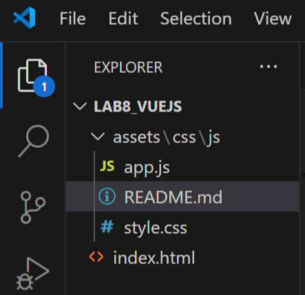

 Menampilkan data
=======================

## File index.html

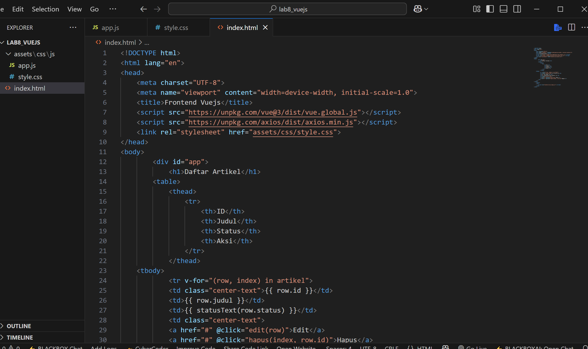

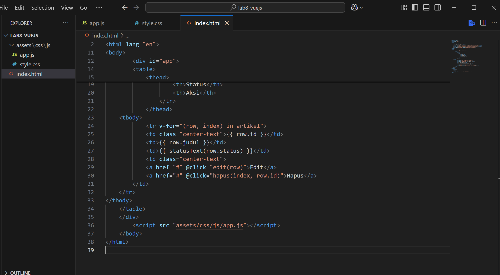

## File apps.js

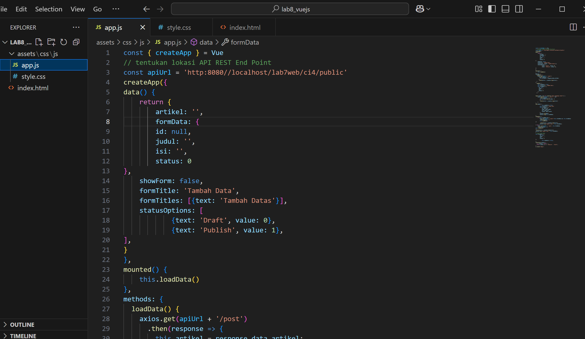

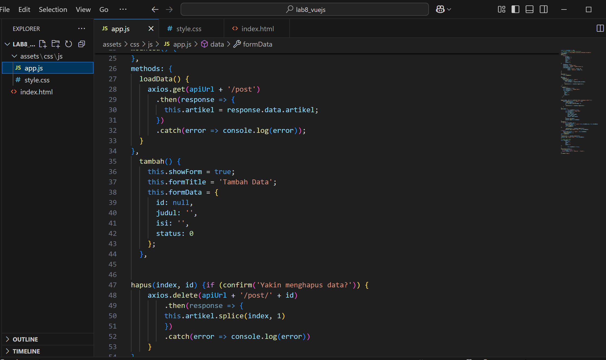

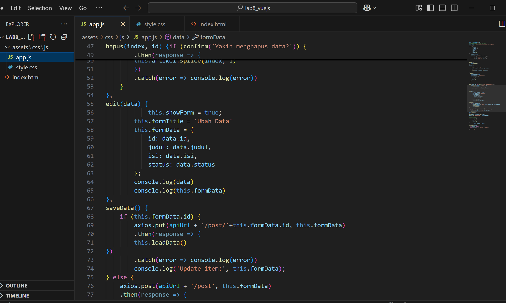

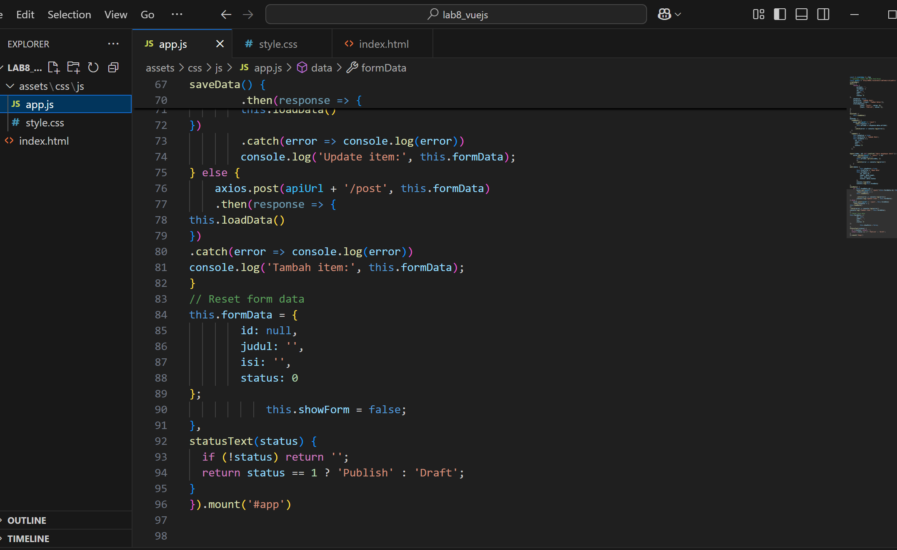

## File style.css

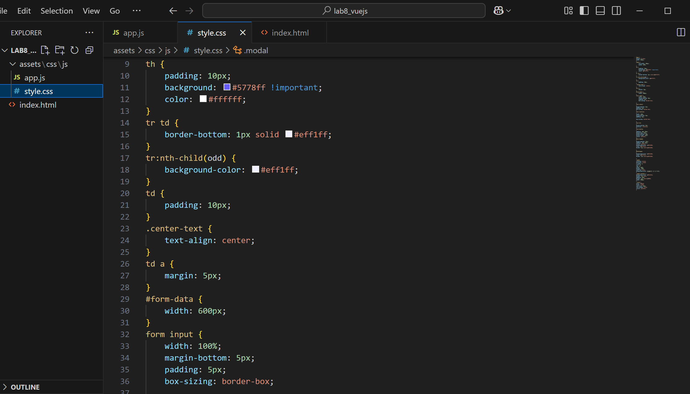

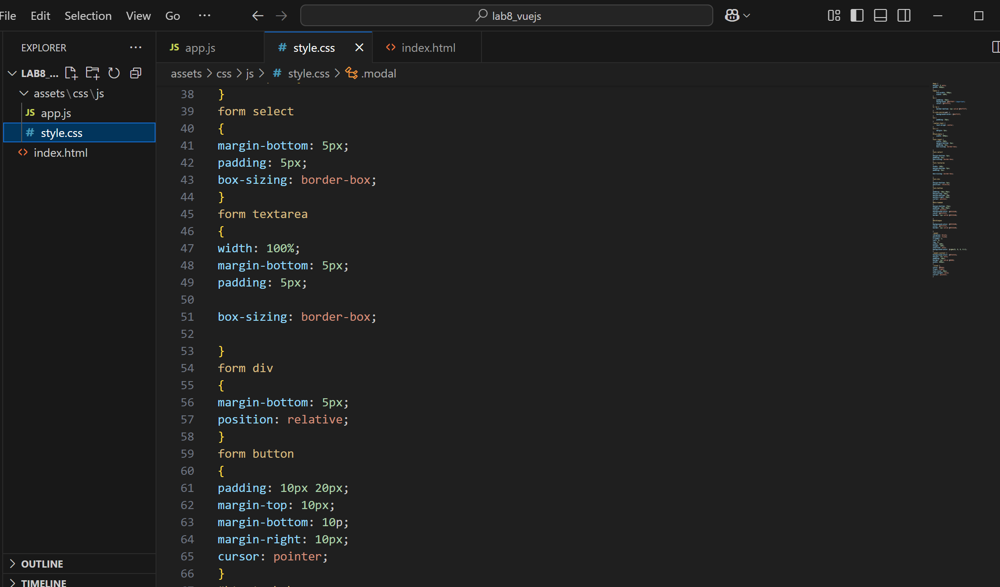

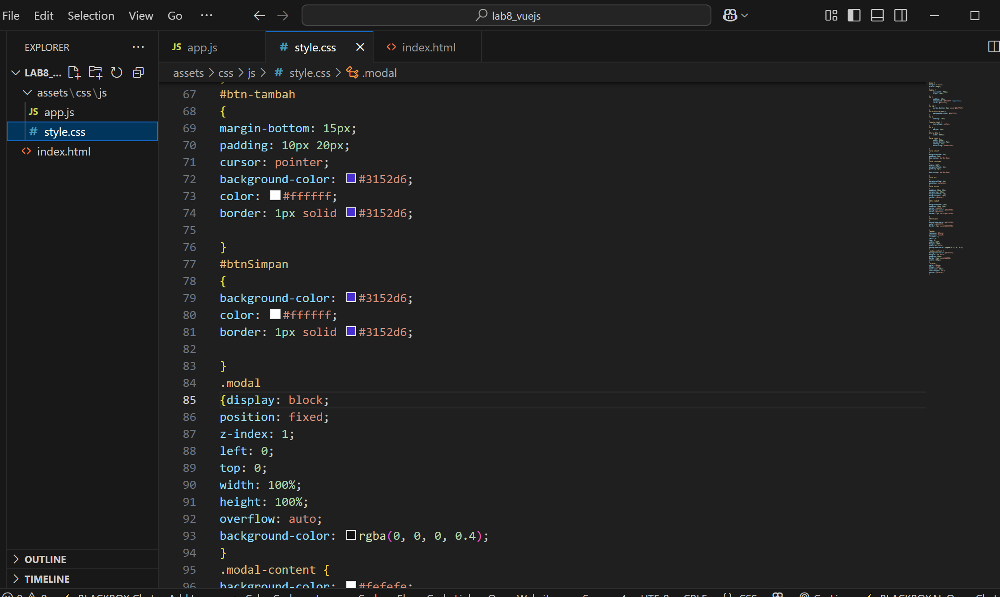

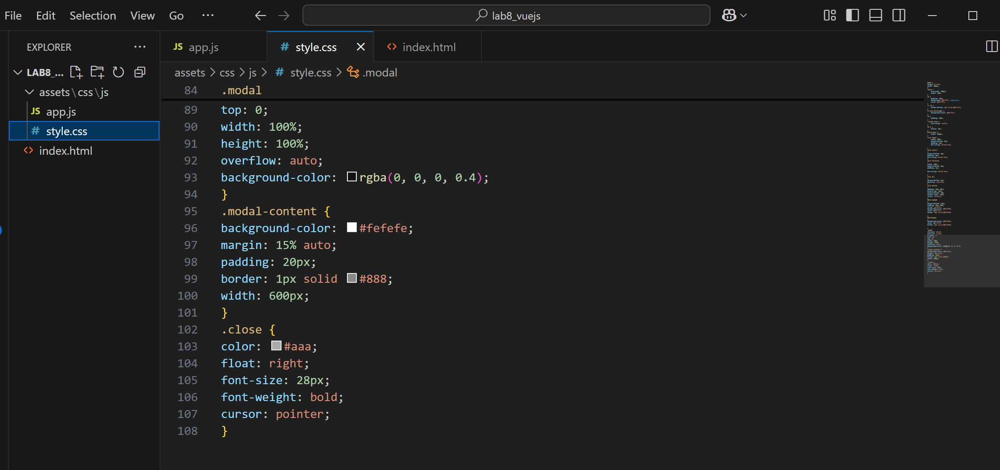

